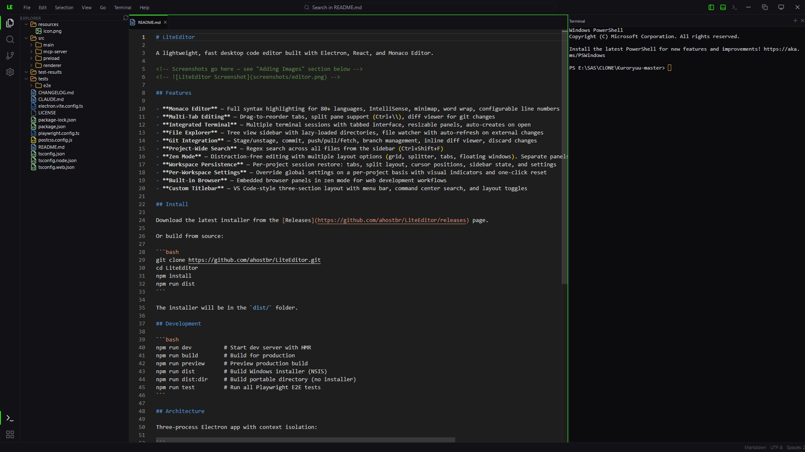
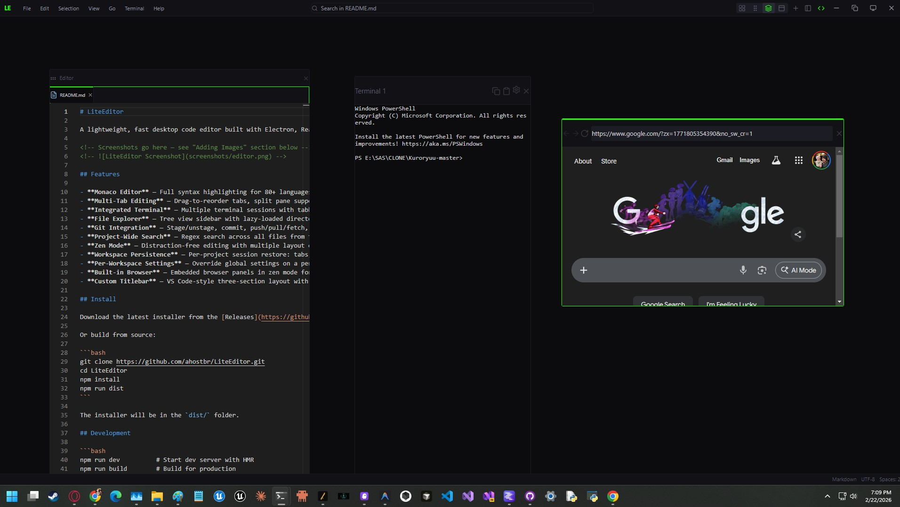
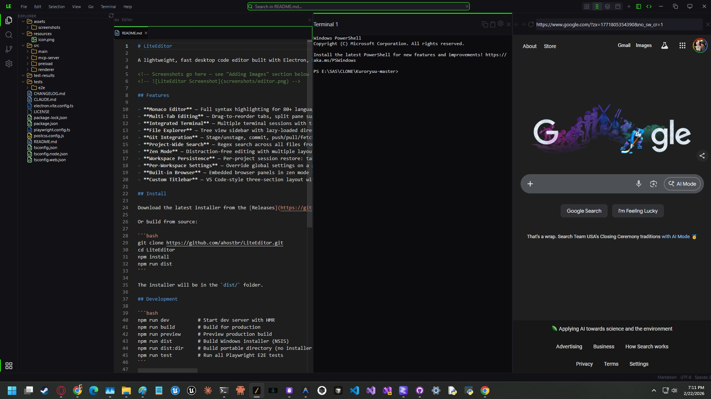

# LiteEditor

A lightweight, fast desktop code editor built with Electron, React, and Monaco Editor.



## Features

- **Monaco Editor** — Full syntax highlighting for 80+ languages, IntelliSense, minimap, word wrap, configurable line numbers
- **Multi-Tab Editing** — Drag-to-reorder tabs, split pane support (Ctrl+\\), diff viewer for git changes
- **Integrated Terminal** — Multiple terminal sessions with tabbed interface, resizable panels, auto-creates on open
- **File Explorer** — Tree view sidebar with lazy-loaded directories, file watcher with auto-refresh on external changes
- **Git Integration** — Stage/unstage, commit, push/pull/fetch, branch management, inline diff viewer, discard changes
- **Project-Wide Search** — Regex search across all files from the sidebar (Ctrl+Shift+F)
- **Zen Mode** — Distraction-free editing with multiple layout options (grid, splitter, tabs, floating windows). Separate panels per file or unified tabbed editor mode
- **Workspace Persistence** — Per-project session restore: tabs, split layout, cursor positions, sidebar state, and settings
- **Per-Workspace Settings** — Override global settings on a per-project basis with visual indicators and one-click reset
- **Built-in Browser** — Embedded browser panels in zen mode for web development workflows
- **Custom Titlebar** — VS Code-style three-section layout with menu bar, command center search, and layout toggles

### Zen Mode

| Grid Layout | Splitter Layout |
|---|---|
|  |  |

## Install

Download the latest installer from the [Releases](https://github.com/ahostbr/LiteEditor/releases) page.

Or build from source:

```bash
git clone https://github.com/ahostbr/LiteEditor.git
cd LiteEditor
npm install
npm run dist
```

The installer will be in the `dist/` folder.

## Development

```bash
npm run dev          # Start dev server with HMR
npm run build        # Build for production
npm run preview      # Preview production build
npm run dist         # Build Windows installer (NSIS)
npm run dist:dir     # Build portable directory (no installer)
npm run test         # Run all Playwright E2E tests
```

## Architecture

Three-process Electron app with context isolation:

```
Main Process (src/main/)         — Node.js: file I/O, git, PTY, search
  |  IPC via preload bridge
Preload (src/preload/)           — Exposes window.api with namespaced methods
  |  contextBridge
Renderer (src/renderer/)         — React 19 + Zustand state management
```

**Key tech:** Electron 34, React 19, Monaco Editor, xterm.js + node-pty, simple-git, Zustand, Tailwind CSS v4, Vite

## MCP Server — Agent Integration

LiteEditor includes a built-in [MCP](https://modelcontextprotocol.io) server that lets AI agents control the editor's terminal and browser panels. This enables workflows like an AI agent running commands in your terminal, browsing the web for documentation, or coordinating with other agents through shared terminal sessions.

### Setup

The MCP server requires Python 3.10+ with [FastMCP](https://github.com/jlowin/fastmcp):

```bash
pip install fastmcp
```

Add the server to your MCP client config (e.g. `~/.claude/mcp.json` for Claude Code):

```json
{
  "mcpServers": {
    "liteeditor": {
      "command": "python",
      "args": ["/path/to/LiteEditor/src/mcp-server/server.py"]
    }
  }
}
```

LiteEditor must be running — the MCP server communicates with the editor via a local HTTP bridge on `127.0.0.1:7423`.

### Tools

The server exposes two tools: `pty` and `browser`. Each tool uses an `action` parameter to select the operation.

#### `pty` — Terminal Control

Manage terminal sessions and enable inter-agent communication through shared PTY sessions.

| Action | Params | Description |
|---|---|---|
| `register` | `agent_id`, `pty_session_id` | Register an agent with a terminal session for inter-agent access |
| `read` | `agent_id` | Read filtered output from an agent's terminal (strips ANSI codes, spinners, progress bars) |
| `write` | `agent_id`, `data` | Send text to an agent's terminal |
| `submit` | `agent_id` | Send Enter keystroke |
| `ctrl` | `agent_id`, `data` | Send Ctrl+key (e.g. `data="c"` for Ctrl+C) |
| `list` | — | List all active PTY sessions |
| `help` | — | Show help and registered agents |

**Inter-agent communication example:**

An agent registers itself with a terminal session. Other agents can then read its output or send it commands:

```
# Agent A registers itself
pty(action="register", agent_id="builder", pty_session_id="pty-1")

# Agent B reads Agent A's terminal output
pty(action="read", agent_id="builder")

# Agent B sends a command to Agent A's terminal
pty(action="write", agent_id="builder", data="npm run build")

# Agent B interrupts Agent A's process
pty(action="ctrl", agent_id="builder", data="c")
```

Agent registrations are persisted at `~/.liteeditor/agents/` (one JSON file per agent) and survive across sessions.

#### `browser` — Browser Panel Control

Control embedded browser panels in zen mode for web automation, testing, and research.

| Action | Params | Description |
|---|---|---|
| `list` | — | List active browser sessions |
| `navigate` | `session_id`, `url` | Load a URL |
| `back` / `forward` | `session_id` | History navigation |
| `reload` | `session_id` | Reload the page |
| `read_page` | `session_id` | Get indexed interactive elements + visible text |
| `screenshot` | `session_id` | Capture page as base64 PNG |
| `click` | `session_id`, `index` | Click element by index |
| `type` | `session_id`, `text`, `[index]` | Type into element (optional focus target) |
| `scroll` | `session_id`, `direction`, `[amount]` | Scroll up/down/left/right |
| `select_option` | `session_id`, `element_index`, `option_index` | Select dropdown option |
| `execute_js` | `session_id`, `code` | Run arbitrary JavaScript |
| `console_logs` | `session_id`, `[since]` | Get console log entries |
| `help` | — | Show help text |

**Browser workflow:**

```
# 1. Find available browser sessions
browser(action="list")

# 2. Navigate to a page
browser(action="navigate", session_id="browser-1-...", url="https://example.com")

# 3. Read the page — get indexed elements and visible text
browser(action="read_page", session_id="browser-1-...")

# 4. Interact with elements by index
browser(action="click", session_id="browser-1-...", index=5)
browser(action="type", session_id="browser-1-...", text="search query", index=3)

# 5. Capture a screenshot
browser(action="screenshot", session_id="browser-1-...")
```

`read_page` returns all interactive elements (links, buttons, inputs, etc.) with numeric indices. Use those indices with `click`, `type`, and `select_option` to interact with the page.

### HTTP Bridge API

For direct integration without MCP, the Agent Bridge exposes a REST API on `127.0.0.1:7423`:

| Endpoint | Method | Description |
|---|---|---|
| `/pty/list` | GET | List PTY sessions |
| `/pty/read` | POST | Read session output |
| `/pty/write` | POST | Write to session |
| `/pty/talk` | POST | Write command + Enter |
| `/browser/list` | GET | List browser sessions |
| `/browser/navigate` | POST | Load URL |
| `/browser/read-page` | POST | Index page elements |
| `/browser/screenshot` | POST | Capture PNG |
| `/browser/click` | POST | Click element |
| `/browser/type` | POST | Type text |
| `/browser/scroll` | POST | Scroll page |
| `/browser/execute-js` | POST | Run JavaScript |
| `/browser/console-logs` | POST | Get console logs |

## Keyboard Shortcuts

| Shortcut | Action |
|---|---|
| Ctrl+S | Save |
| Ctrl+O | Open file |
| Ctrl+Shift+O | Open folder |
| Ctrl+W | Close tab |
| Ctrl+\\ | Split pane |
| Ctrl+B | Toggle sidebar |
| Ctrl+Shift+F | Search in files |
| Ctrl+Shift+E | Explorer panel |
| Ctrl+Shift+G | Source control panel |
| Ctrl+Shift+T | Toggle zen mode |
| Ctrl+Tab | Next tab |
| Ctrl+Shift+Tab | Previous tab |
| Ctrl+=/-/0 | Zoom in/out/reset |

## License

This project is licensed under the [GNU General Public License v3.0](LICENSE).
